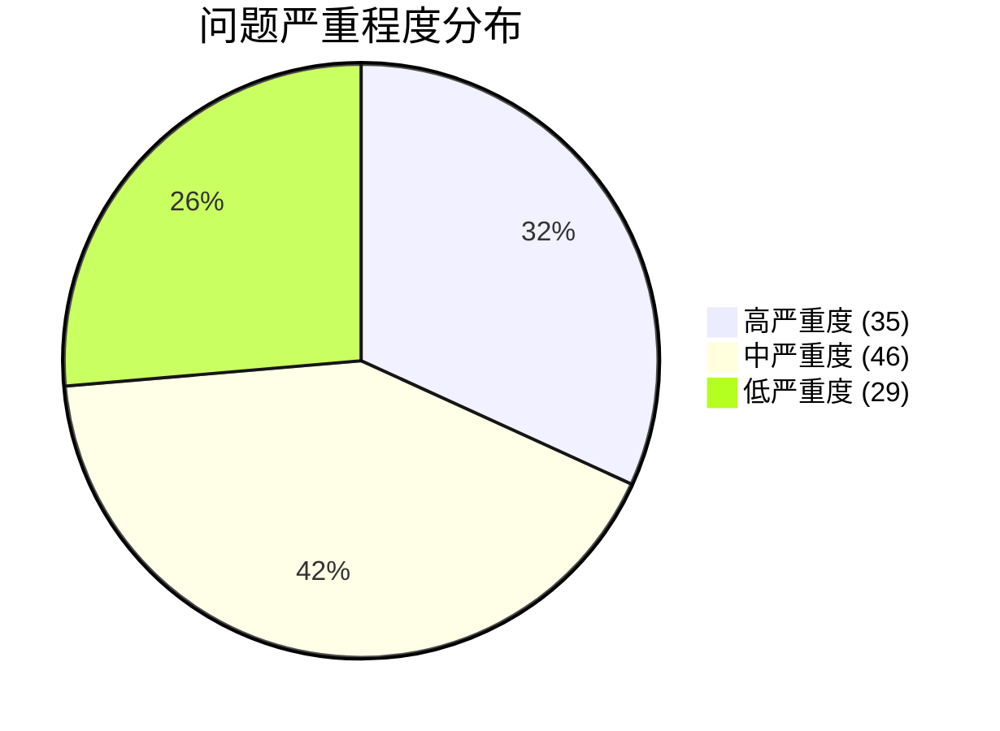

# EmberInterDebugTool (尘智) 项目整改报告

> **审查日期**: 2026-06-20
> **审查范围**: 全项目代码、构建系统、部署脚本、文档
> **构建验证**: MSYS2 MinGW64 + Qt6 干净重建通过，无编译错误和警告
> **问题总计**: 110 个（高严重度 35 / 中严重度 46 / 低严重度 29）

---

## 一、审查概览

### 1.1 审查范围

| 模块 | 文件数 | 问题数 | 关键风险 |
|------|--------|--------|----------|
| `src/core/` | 17 | 42 | 线程安全、资源泄漏、VT 解析不完整 |
| `src/gui/` | 22 | 38 | OpenGL 资源泄漏、DebugTab 未加载、状态管理错乱 |
| `src/cli/` | 5 | 12 | 交互模式不可用、协议字段不匹配、功能未实现 |
| 构建系统 | 6 | 6 | tests 目录缺失、OpenGL 组件未声明、spdlog 未链接 |
| 部署脚本 | 2 | 3 | 硬编码路径、iss 引用缺失文件、QML 插件未复制 |
| 项目文档 | 8 | 8 | Qt5/Qt6 不一致、版本号混乱、项目结构过时 |
| 资源文件 | 3 | 3 | QSS 遗留文件、app.ico 未使用、QRC 路径设计 |
| **合计** | **63** | **110** | — |

### 1.2 构建验证结果

```
[100%] Built target serial-monitor
[100%] Built target serial-monitor-cli
```

- 编译通过，无错误
- 无编译警告（`-Wall -Wextra`）
- 生成 `serial-monitor.exe` 和 `serial-monitor-cli.exe`
- 所有问题均为**运行时逻辑问题**、**资源管理问题**或**未实现功能**

### 1.3 问题严重程度分布



---

## 二、高严重度问题（必须立即修复）

### 2.1 core 模块（14 个）

#### H-CORE-01: SerialEngine 跨线程访问 QSerialPort（线程安全）

- **文件**: [serial_engine.cpp](file:///f:/work/software/serial-monitor/src/core/serial_engine.cpp#L38-L213)
- **行号**: 38-40, 104-144, 161-188, 190-213
- **问题类型**: 线程安全
- **描述**: `serial_` 通过 `moveToThread(workerThread_)` 移到 worker 线程（第 24 行），但以下方法都在主线程中直接调用 `serial_` 的方法，违反 Qt 线程亲和性规则：
  - `sendText/sendHex/sendRaw`（第 113、126、139 行）调用 `serial_->write()`
  - `isOpen()`（第 101 行）调用 `serial_->isOpen()`
  - `onReadyRead()`（第 163 行）调用 `serial_->readAll()`
  - `onError()`（第 176-182 行）调用 `serial_->errorString()`、`serial_->close()`
  - `tryReconnect()`（第 192-201 行）调用 `serial_->setPortName()` 等
- **影响**: 随机崩溃、数据损坏
- **修复方案**: 将所有串口操作通过 `QMetaObject::invokeMethod` 转发到 worker 线程执行，或让 `SerialEngine` 本身移到 worker 线程

#### H-CORE-02: SerialEngine 跨线程 delete QObject（资源管理）

- **文件**: [serial_engine.cpp](file:///f:/work/software/serial-monitor/src/core/serial_engine.cpp#L59-L82)
- **行号**: 59-82
- **问题类型**: 资源管理 / 线程安全
- **描述**: `stopWorkerThread()` 中：
  - 第 62 行 `reconnectTimer_->stop()`：timer 已 moveToThread，主线程调用违规
  - 第 66-68 行 `serial_->close()`：同上
  - 第 78 行 `delete serial_`：QObject 必须在所属线程中 delete，跨线程 delete 是未定义行为
  - 第 80 行 `delete reconnectTimer_`：同上
- **修复方案**: 使用 `QObject::deleteLater()` 配合 `QThread::quit()`

#### H-CORE-03: SerialEngine 空指针解引用风险

- **文件**: [serial_engine.cpp](file:///f:/work/software/serial-monitor/src/core/serial_engine.cpp#L186-L192)
- **行号**: 186, 192
- **问题类型**: 错误处理缺失
- **描述**: `onError()` 第 186 行 `reconnectTimer_->start()` 和 `tryReconnect()` 第 192 行 `serial_->isOpen()` 没有判空。使用 QueuedConnection 时，事件可能在 `stopWorkerThread` 完成后才被处理，此时指针已置空
- **修复方案**: 在 `onError` 和 `tryReconnect` 开头添加 `if (!serial_ || !reconnectTimer_) return;`

#### H-CORE-04: ConPTY 管道句柄泄漏

- **文件**: [pty_process_win.cpp](file:///f:/work/software/serial-monitor/src/core/pty_process_win.cpp#L188-L221)
- **行号**: 188-221
- **问题类型**: 资源管理
- **描述**: `createConPtyPipes()` 创建的 `hInRead` 和 `hOutWrite` 传给 `CreatePseudoConsole` 后从未关闭。根据 Microsoft 文档，调用者负责关闭原始句柄。每次启动进程泄漏 2 个内核句柄
- **修复方案**: 在 `s_fnCreate_()` 成功后立即 `CloseHandle(hInRead); CloseHandle(hOutWrite);`

#### H-CORE-05: PtyReadThread::stop() 设计缺陷导致阻塞

- **文件**: [pty_process_win.cpp](file:///f:/work/software/serial-monitor/src/core/pty_process_win.cpp#L38-L43)
- **行号**: 38-43, 225-241
- **问题类型**: 线程安全 / 资源管理
- **描述**: `PtyReadThread::stop()` 内部调用 `wait(3000)`，但 `ReadFile` 仍在阻塞，`wait` 必然超时 3 秒。然后 `cleanup()` 再关闭句柄解除阻塞，再 `wait(3000)`。导致白白等待 3 秒，且时序依赖外部代码
- **修复方案**: `stop()` 只设置 `stopping_ = true`，不调用 `wait()`，由调用方先关闭句柄再 `wait()`

#### H-CORE-06: Unix PTY 读取未处理 EOF 导致 CPU 100%

- **文件**: [pty_process_unix.cpp](file:///f:/work/software/serial-monitor/src/core/pty_process_unix.cpp#L186-L198)
- **行号**: 186-198
- **问题类型**: 逻辑错误
- **描述**: `onMasterReadyRead()` 中 `read()` 返回 0（EOF，子进程关闭 PTY）未处理，`QSocketNotifier` 会持续触发，导致 CPU 占用 100%
- **修复方案**:
  ```cpp
  if (n == 0) {
      running_ = false;
      emit finished(-1);
      return;
  }
  ```

#### H-CORE-07: Unix PTY terminate() 阻塞主线程

- **文件**: [pty_process_unix.cpp](file:///f:/work/software/serial-monitor/src/core/pty_process_unix.cpp#L286-L325)
- **行号**: 286-325
- **问题类型**: 线程安全 / 资源管理
- **描述**: `terminate()` 中第 309 行 `usleep(200000)` 阻塞主线程 200ms；第 316 行 `waitpid(childPid_, &status, 0)` 是阻塞等待，子进程不响应 SIGKILL 时会永久阻塞主线程
- **修复方案**: 使用非阻塞 `waitpid(WNOHANG)` + `QTimer` 轮询，设置最大重试次数

#### H-CORE-08: VT 解析器 DCS 数据未收集（未实现功能）

- **文件**: [vt_parser.cpp](file:///f:/work/software/serial-monitor/src/core/terminal/vt_parser.cpp#L325-L347)
- **行号**: 325-347, 474-477
- **问题类型**: 未实现功能
- **描述**: DCS（Device Control String）状态机不完整。`dcsCollect()` 方法已实现但**从未被调用**，`dcsBuffer_` 始终为空。所有 DCS 序列（Sixel 图形、DECUDK 自定义键）都会丢失数据
- **修复方案**: 在 `dcsHook()` 后转换到新的 `DcsData` 状态，调用 `dcsCollect(byte)` 收集数据，收到 ESC 时调用 `dcsUnhook()`

#### H-CORE-09: VT 解析器 ESC 中间字节丢失

- **文件**: [vt_parser.cpp](file:///f:/work/software/serial-monitor/src/core/terminal/vt_parser.cpp#L251-L264)
- **行号**: 251-264, 487-494
- **问题类型**: 逻辑错误
- **描述**: ESC 状态下收到中间字节（0x20-0x2F）时存入 `escIntermediates_`，但收到最终字节构造 `EscDispatch` 事件时**没有将 `escIntermediates_` 赋给 `ev.escIntermediates`**。`escDispatch()` 方法已实现但从未被调用。导致 `ESC SP F`、`ESC # 8` 等带中间字节的 ESC 序列中间字节被丢弃
- **修复方案**: 在事件构造中添加 `ev.escIntermediates = escIntermediates_;`，dispatch 后 `escIntermediates_.clear()`

#### H-CORE-10: TerminalBuffer::ensureRow 是空操作（潜在 UB）

- **文件**: [terminal_buffer.cpp](file:///f:/work/software/serial-monitor/src/core/terminal/terminal_buffer.cpp#L577-L581)
- **行号**: 577-581, 493-497
- **问题类型**: 逻辑错误
- **描述**: `ensureRow(int row)` 实现只有 `(void)row;`，什么都不做。但 `line(int row)` 在第 495 行调用 `ensureRow(row)` 后直接 `return screen_[row];`。如果 `row` 越界，`screen_[row]` 是未定义行为
- **修复方案**: 改为边界检查，越界返回空 vector 引用

#### H-CORE-11: TerminalBuffer 在 cols_/rows_ 为 0 时 std::clamp UB

- **文件**: [terminal_buffer.cpp](file:///f:/work/software/serial-monitor/src/core/terminal/terminal_buffer.cpp#L114)
- **行号**: 114, 122, 156-157, 165-166, 58-59
- **问题类型**: 逻辑错误
- **描述**: 多处使用 `std::clamp(value, 0, cols_ - 1)`。当 `cols_` 或 `rows_` 为 0 时，`cols_ - 1` = -1，`std::clamp(value, 0, -1)` 要求 `low <= high`，否则是未定义行为
- **修复方案**: 在 clamp 前检查 `if (cols_ <= 0 || rows_ <= 0) return;`

#### H-CORE-12: SavedPort 缺少 flowcontrol 字段

- **文件**: [config_manager.h](file:///f:/work/software/serial-monitor/src/core/config_manager.h#L12-L49)
- **行号**: 12-49
- **问题类型**: 逻辑错误
- **描述**: `SavedPort` 结构体有 `databits`、`parity`、`stopbits` 字段，但**缺少 `flowcontrol` 字段**。`toSerialConfig()` 不设置 `flowcontrol`，导致流控设置在保存/加载配置后丢失，始终恢复为默认值 `NoFlowControl`
- **修复方案**:
  1. 在 `SavedPort` 中添加 `QSerialPort::FlowControl flowcontrol = QSerialPort::NoFlowControl;`
  2. 在 `toSerialConfig()` 中设置 `cfg.flowcontrol = flowcontrol;`
  3. 在 `load()`/`save()` 中添加 flowcontrol 的序列化

#### H-CORE-13: ConPTY GenerateConsoleCtrlEvent 目标错误

- **文件**: [pty_process_win.cpp](file:///f:/work/software/serial-monitor/src/core/pty_process_win.cpp#L457-L466)
- **行号**: 457-466
- **问题类型**: 逻辑错误
- **描述**: `terminate()` 中 `GenerateConsoleCtrlEvent(CTRL_C_EVENT, 0)` 第二个参数 `0` 表示发送到调用进程所在的控制台进程组，但子进程运行在伪控制台中，不在同一进程组。实际上不会向子进程发送 Ctrl+C，只能依赖 2 秒后的 `TerminateProcess` 强制终止
- **修复方案**:
  1. `CreateProcessW` 时添加 `CREATE_NEW_PROCESS_GROUP` 标志
  2. 保存 `pi.dwProcessId` 作为进程组 ID
  3. `GenerateConsoleCtrlEvent(CTRL_C_EVENT, childProcessGroupId)`

#### H-CORE-14: ConPTY 命令行参数转义不足（注入风险）

- **文件**: [pty_process_win.cpp](file:///f:/work/software/serial-monitor/src/core/pty_process_win.cpp#L288-L296)
- **行号**: 288-296
- **问题类型**: 安全
- **描述**: 命令行构建逻辑：如果参数包含双引号，只是简单地用双引号包裹，**没有转义内部的双引号**。参数 `a"b` 会变成 `"a"b"`，被解析为 `a`、`b` 两个参数，可能导致命令注入
- **修复方案**: 使用 Windows 命令行转义规则：内部双引号替换为 `\"`，反斜杠在双引号前需要加倍

### 2.2 gui 模块（11 个）

#### H-GUI-01: OpenGL 资源严重泄漏

- **文件**: [terminal_view.cpp](file:///f:/work/software/serial-monitor/src/gui/qml/terminal/terminal_view.cpp#L17-L252)
- **行号**: 17-252（TerminalFboRenderer 类）
- **问题类型**: 资源管理
- **描述**: `TerminalRenderer::cleanup()` 和 `GlyphAtlas::cleanup()` 方法已定义但**从未被调用**。`TerminalFboRenderer` 没有重写 `invalidate()` 也没有析构函数调用 cleanup。`new QOpenGLShaderProgram()` 创建的着色器程序和 `glGenTextures` 创建的纹理都不会被释放。每次关闭终端 Tab 或字体变更都会泄漏 GL 资源
- **修复方案**: 在 `TerminalFboRenderer` 中重写 `invalidate()` 虚函数，调用 `renderer_.cleanup(this)` 和 `atlasPtr_->cleanup(this)`；添加析构函数作为最后保障

#### H-GUI-02: main.qml 中 DebugTab 未被加载

- **文件**: [main.qml](file:///f:/work/software/serial-monitor/src/gui/qml/main.qml#L697-L707)
- **行号**: 697-707
- **问题类型**: 逻辑错误 / 未实现功能
- **描述**: `Loader.source` 的 switch 语句只处理 `case 0` (Serial)、`case 1` (CMD)、`case 2` (SSH)，缺少 `case 3` (STLink) 和 `case 4` (JLink) 的分支。`default` 分支将 `src` 设为空字符串，导致 ST-Link/J-Link 类型的 Tab 加载空白页面，而 `DebugTab.qml` 文件存在且完整
- **修复方案**: 添加 `case 3: case 4: src = "DebugTab.qml"; break`

#### H-GUI-03: ConnectionWizard 无法选择 1.5 停止位

- **文件**: [ConnectionWizard.qml](file:///f:/work/software/serial-monitor/src/gui/qml/ConnectionWizard.qml#L256)
- **行号**: 256
- **问题类型**: 逻辑错误
- **描述**: `root.wizardStopBits = parseInt(currentText) || 1`，当用户选择 "1.5" 时，`parseInt("1.5")` 返回 1，导致 1.5 停止位永远无法被选中。`QSerialPort::OneAndHalfStop` 是枚举值 3
- **修复方案**: 使用索引映射 `root.wizardStopBits = [1, 3, 2][currentIndex]`

#### H-GUI-04: AppCore 状态栏 RX/TX 显示错误

- **文件**: [app_core.cpp](file:///f:/work/software/serial-monitor/src/gui/qml/app_core.cpp#L524-L541)
- **行号**: 524-541
- **问题类型**: 逻辑错误 / 状态管理
- **描述**: 当任意 Tab 发出 `rxBytesChanged` 信号时，`rxBytes_` 被更新为该 Tab 的值，但 `updateStatus()` 读取的是 `currentTabIdx_` 对应的 Tab 的 `rxBytes()`。多 Tab 场景下状态栏显示错乱，IPC `get_status` 命令返回错误值
- **修复方案**: 在 `onTabRxChanged` 中检查 `sender() == tabModel_.tabAt(currentTabIdx_)`，仅当是当前 Tab 时才更新；IPC 命令直接读取当前 Tab 的 `rxBytes()`

#### H-GUI-05: TerminalTabPage::attachView 重复调用导致信号重复连接

- **文件**: [terminal_tab_page.cpp](file:///f:/work/software/serial-monitor/src/gui/qml/terminal_tab_page.cpp#L33-L67)
- **行号**: 33-67
- **问题类型**: 逻辑错误 / 信号槽连接错误
- **描述**: `TerminalTab.qml` 在三处调用 `tabPage.attachView(termView)`，而 `attachView` 每次都执行 `connect(view_, &TerminalView::shellStarted, ...)`，没有检查是否已连接。多次调用导致同一信号触发多次 lambda
- **修复方案**: 在 `attachView` 开头检查 `if (view_ == view) return;` 防止重复连接

#### H-GUI-06: TerminalTabPage 信号连接未管理 view_ 生命周期

- **文件**: [terminal_tab_page.cpp](file:///f:/work/software/serial-monitor/src/gui/qml/terminal_tab_page.cpp#L43-L56)
- **行号**: 43-56
- **问题类型**: 资源管理 / 线程安全
- **描述**: `attachView` 中 `connect(view_, ..., this, [this](){...})` 使用 lambda 捕获 `this`，但 `view_` 是 QML 创建的对象，其生命周期由 QML 引擎管理。如果 QML 销毁 `TerminalView` 但 `TerminalTabPage` 仍然存在，`view_` 成为悬垂指针
- **修复方案**: 使用 `QPointer<TerminalView>` 替代裸指针

#### H-GUI-07: TabPage::disconnect() 隐藏 QObject::disconnect() 重载

- **文件**: [tab_page.h](file:///f:/work/software/serial-monitor/src/gui/qml/tab_page.h#L22)
- **行号**: 22
- **问题类型**: 编译错误 / 设计问题
- **描述**: `virtual void disconnect() = 0;` 声明会隐藏 `QObject` 的所有 `disconnect()` 重载。`AppCore::closeTab` 第 394 行 `page->disconnect()` 调用的是 `TabPage::disconnect()`（断开串口/终端连接），而非 `QObject::disconnect()`（断开信号槽）
- **修复方案**: 将虚方法重命名为 `closeConnection()` 或 `disconnectFromHost()`

#### H-GUI-08: SerialTabPage 析构时发出信号可能不安全

- **文件**: [serial_tab_page.cpp](file:///f:/work/software/serial-monitor/src/gui/qml/serial_tab_page.cpp#L123-L126)
- **行号**: 123-126
- **问题类型**: 资源管理
- **描述**: `~SerialTabPage()` 调用 `disconnect()`，后者发出 `connectedChanged()` 和 `statusChanged(false)` 信号。在析构过程中发出信号，如果信号接收方已经销毁或正在销毁，会导致未定义行为
- **修复方案**: 在析构函数中直接调用 `engine_.close()` 而非 `disconnect()`，或使用 `blockSignals(true)`

#### H-GUI-09: DebugTab.qml parseInt 无法解析十六进制地址

- **文件**: [DebugTab.qml](file:///f:/work/software/serial-monitor/src/gui/qml/DebugTab.qml#L460)
- **行号**: 460, 505
- **问题类型**: 逻辑错误
- **描述**: `var addr = parseInt(memAddr.text) || 0x08000000`，当用户输入 "0x08000000" 时，`parseInt("0x08000000")` 返回 0（默认十进制解析），然后 `|| 0x08000000` 使用默认值。用户输入的任何十六进制地址都会被忽略
- **修复方案**: 使用 `parseInt(memAddr.text, 16)` 或 `parseInt(memAddr.text.replace(/^0x/i, ""), 16)`

#### H-GUI-10: AppCore::openAbout 违反 QML 驱动设计原则

- **文件**: [app_core.cpp](file:///f:/work/software/serial-monitor/src/gui/qml/app_core.cpp#L414-L423)
- **行号**: 414-423
- **问题类型**: 架构违规
- **描述**: `openAbout()` 同时发出 `aboutRequested()` 信号（让 QML 打开对话框）并直接调用 `QMessageBox::about()`。用户会看到两个"关于"弹窗。违反"gui/ QML 驱动: UI 由 QML 负责"的设计原则
- **修复方案**: 删除 `QMessageBox::about()` 调用，仅保留 `emit aboutRequested()`；从 CMakeLists.txt 移除 `Qt6::Widgets` 依赖

#### H-GUI-11: IPCServer::stop() 未等待客户端断开完成

- **文件**: [ipc_server.cpp](file:///f:/work/software/serial-monitor/src/gui/ipc_server.cpp#L35-L51)
- **行号**: 35-51
- **问题类型**: 错误处理缺失 / 资源管理
- **描述**: `stop()` 中调用 `client->disconnectFromServer()` 后立即继续循环，没有等待 disconnect 完成。`QLocalSocket::disconnectFromServer()` 是异步的，缓冲区中还有数据未发送可能会丢失。`client->deleteLater()` 在 `onDisconnected` 槽中调用，如果 `disconnectFromServer()` 没有触发 `disconnected` 信号，`deleteLater` 不会被调用，导致 `clients_` 中的指针泄漏
- **修复方案**: 在 `stop()` 中显式 `client->waitForDisconnected(1000)` 或直接 `delete client`

### 2.3 cli 模块（4 个）

#### H-CLI-01: 交互模式阻塞 Qt 事件循环，IPC 信号无法处理

- **文件**: [cli_app.cpp](file:///f:/work/software/serial-monitor/src/cli/cli_app.cpp#L258-L283)
- **行号**: 258-283
- **问题类型**: 逻辑错误 / 架构缺陷
- **描述**: `runInteractive()` 使用 `while(true)` 同步循环读取 `stdin`，完全阻塞了 Qt 事件循环。交互模式下所有 IPC 信号（`logReceived`、`statusChanged`、`responseReceived`）都无法被派发和处理。用户输入 `list`、`status`、`send` 等命令后，无法收到任何 IPC 响应或实时日志推送。**交互模式基本不可用**
- **修复方案**: 改用 `QSocketNotifier` 监听 `fileno(stdin)` 异步读取，或使用 `QTimer::singleShot(0, ...)` 在每次读取一行后返回事件循环

#### H-CLI-02: `--list` 响应字段名不匹配，端口名显示为空

- **文件**: [cli_app.cpp](file:///f:/work/software/serial-monitor/src/cli/cli_app.cpp#L460-L466) vs [app_core.cpp](file:///f:/work/software/serial-monitor/src/gui/qml/app_core.cpp#L594-L605)
- **行号**: CLI 460-466, GUI 594-605
- **问题类型**: 协议不匹配
- **描述**: CLI 期望端口对象包含 `name` 和 `recommended` 字段，但 GUI 的 `list_ports` 处理器返回的字段是 `port`、`description`、`manufacturer`。导致 `--list` 命令输出的端口名全部为空字符串
- **修复方案**: 统一字段名。CLI 改为读取 `p["port"]`，或 GUI 改为返回 `name` 字段

#### H-CLI-03: `--send-file` 功能未实现

- **文件**: [cli_app.cpp](file:///f:/work/software/serial-monitor/src/cli/cli_app.cpp#L163-L181) vs [app_core.cpp](file:///f:/work/software/serial-monitor/src/gui/qml/app_core.cpp#L655-L657)
- **行号**: CLI 163-181, GUI 655-657
- **问题类型**: 未实现功能
- **描述**: CLI 的 `--send-file` 选项读取文件、Base64 编码后发送 `send_file` 命令给 GUI。但 GUI 端响应是 `data["message"] = "send_file not implemented yet";`。功能完全不可用，但 CLI 帮助文档宣传了此功能
- **修复方案**: 在 GUI 端实现 `send_file` 命令处理，或在 CLI 帮助中标注此功能未实现

#### H-CLI-04: `--connect` 命令需要已存在的活动 Tab，逻辑矛盾

- **文件**: [app_core.cpp](file:///f:/work/software/serial-monitor/src/gui/qml/app_core.cpp#L627-L674)
- **行号**: 627-674
- **问题类型**: 逻辑错误
- **描述**: `--connect` 命令的 GUI 处理逻辑被包裹在需要活动 SerialTabPage 的代码块中。这意味着 `--connect` 命令只有在 GUI 中已经打开了一个串口 Tab 时才能工作，且它只是修改现有 Tab 的连接参数，而非创建新连接。违背了 `--connect` 的设计意图
- **修复方案**: 将 `connect` 命令的处理移出需要活动 Tab 的代码块，使其能够创建新的 Tab

### 2.4 构建系统与部署（4 个）

#### H-BUILD-01: 根 CMakeLists.txt 引用不存在的 tests 目录

- **文件**: [CMakeLists.txt](file:///f:/work/software/serial-monitor/CMakeLists.txt#L26-L34)
- **行号**: 26-34
- **问题类型**: 构建错误
- **描述**: `BUILD_TESTS` 默认为 `ON`，如果系统中安装了 GTest，CMake 会尝试 `add_subdirectory(tests)`，但项目中不存在 `tests/` 目录。导致 CMake 配置阶段报错
- **修复方案**: 将默认值改为 `OFF`，或创建 `tests/` 目录

#### H-BUILD-02: GUI 链接 Qt6::OpenGL 但未在 find_package 中声明

- **文件**: [CMakeLists.txt](file:///f:/work/software/serial-monitor/CMakeLists.txt#L12) vs [src/gui/CMakeLists.txt](file:///f:/work/software/serial-monitor/src/gui/CMakeLists.txt#L50)
- **行号**: 根 12, gui 50
- **问题类型**: 构建错误
- **描述**: `src/gui/CMakeLists.txt` 第 50 行链接了 `Qt6::OpenGL`，但根 CMakeLists.txt 的 `find_package` 未声明 `OpenGL` 组件。可能导致 CMake 报错
- **修复方案**: 在根 `find_package` 中添加 `OpenGL` 组件

#### H-DEPLOY-01: deploy.sh 硬编码项目路径

- **文件**: [deploy.sh](file:///f:/work/software/serial-monitor/deploy/deploy.sh#L5)
- **行号**: 5
- **问题类型**: 可移植性
- **描述**: `PROJECT_DIR="/f/work/software/serial-monitor"` 硬编码绝对路径，在其他开发环境或 CI/CD 中无法使用
- **修复方案**: `PROJECT_DIR="$(cd "$(dirname "${BASH_SOURCE[0]}")/.." && pwd)"`

#### H-DEPLOY-02: emberInter.iss 引用了 deploy.sh 未生成的文件

- **文件**: [emberInter.iss](file:///f:/work/software/serial-monitor/deploy/emberInter.iss#L39)
- **行号**: 39, 43, 25
- **问题类型**: 部署脚本不一致
- **描述**:
  - `.iss` 第 39 行引用 `emberInter\imageformats\*.dll`，但 `deploy.sh` 从未复制 `imageformats` 目录
  - `.iss` 第 43 行引用 `emberInter\skill\*`，但 `deploy.sh` 从未创建或复制 `skill` 目录
  - `.iss` 第 25 行引用 `SetupIconFile=emberInter\icons\app.ico`，但 `deploy.sh` 只复制了 `logo.png`
- **修复方案**: 在 `deploy.sh` 中添加复制步骤，或从 `.iss` 中移除不存在的文件引用

### 2.5 文档（2 个）

#### H-DOC-01: README.md 和 project.md 描述 Qt5，实际使用 Qt6

- **文件**: [README.md](file:///f:/work/software/serial-monitor/README.md#L5) 第 5、24 行；[project.md](file:///f:/work/software/serial-monitor/project.md#L3) 第 3、20 行
- **问题类型**: 文档与代码不一致
- **描述**: README.md 第 5 行："基于 Qt5 的跨平台串口监控调试工具"；第 24 行："Qt5 (Widgets, SerialPort, Network)"。但实际代码使用 Qt6
- **修复方案**: 将所有 "Qt5" 改为 "Qt6"

#### H-DOC-02: README.md 项目结构列出不存在的文件

- **文件**: [README.md](file:///f:/work/software/serial-monitor/README.md#L295)
- **行号**: 295-300
- **问题类型**: 文档与代码不一致
- **描述**: README.md 项目结构列出了 `main_window`、`log_view`、`send_panel`、`status_bar`、`serial_port_dialog`、`serial_tab_widget` 等不存在的文件。这些是 Qt5 Widgets 时代的遗留文件名
- **修复方案**: 更新项目结构以反映实际的 QML 文件结构

---

## 三、中严重度问题（应尽快修复）

### 3.1 core 模块（16 个）

| 编号 | 文件 | 行号 | 类型 | 简述 |
|------|------|------|------|------|
| M-CORE-01 | log_buffer.cpp | 34-48 | 逻辑错误 | `getRecent` 负数 count 导致迭代器越界 UB |
| M-CORE-02 | log_buffer.cpp | 80-83 | 线程安全 | `maxSize()` 非线程安全，未加锁读取 `maxSize_` |
| M-CORE-03 | log_exporter.cpp | 59-75 | 死代码 | `escapeJson` 从未被调用且实现不完整 |
| M-CORE-04 | log_exporter.cpp | 27 | 错误处理 | `file.write()` 返回值未检查 |
| M-CORE-05 | config_manager.cpp | 108, 115 | 错误处理 | 枚举值未校验，无效值强制转换 |
| M-CORE-06 | vt_parser.cpp | 364-411 | 安全 | 未检测 overlong UTF-8 和无效码点 |
| M-CORE-07 | vt_parser.cpp | 496-543 | 逻辑错误 | `charWidth` 缺少部分 CJK/Emoji 范围 |
| M-CORE-08 | terminal_input.cpp | 49-53 | 逻辑错误 | 修饰键组合处理不完整，Shift+Alt 错误编码为 Alt |
| M-CORE-09 | terminal_input.cpp | 204-247 | 未实现 | URXVT 鼠标编码未实现，fall through 到 X10 |
| M-CORE-10 | terminal_input.cpp | 129-140 | 未实现 | 缺少 Ctrl+2/3/4/5/8 快捷键 |
| M-CORE-11 | pty_process_win.cpp | 162-184 | 错误处理 | `loadConPtyApi` 未检查 `s_fnResize_` |
| M-CORE-12 | pty_process_win.cpp | 301 | 逻辑错误 | `STARTF_USESTDHANDLES` 在 ConPTY 模式下可能不正确 |
| M-CORE-13 | pty_process_win.cpp | 225-269 | 资源管理 | `cleanup()` 顺序可能不正确，导致输出数据丢失 |
| M-CORE-14 | vt_parser.cpp | 444-461 | 逻辑错误 | `oscDispatch` 命令号处理逻辑错误 |
| M-CORE-15 | serial_engine.cpp | 215-224 | 代码质量 | `buildAppend` 使用魔法字符串 "CR"/"LF"/"NONE"/"CRLF" |
| M-CORE-16 | terminal_buffer.cpp | 566 | 逻辑错误 | `selectedText` 跳过空格，"hello world" 变 "helloworld" |

### 3.2 gui 模块（17 个）

| 编号 | 文件 | 行号 | 类型 | 简述 |
|------|------|------|------|------|
| M-GUI-01 | main.cpp | 28-36 | 错误处理 | 单实例检查的 IPC 连接返回值未检查 |
| M-GUI-02 | app_core.cpp | 204-206 | 错误处理 | `confirmConnection` 对无效 connType 静默返回 |
| M-GUI-03 | app_core.cpp | 449-455 | 未实现 | `loadTabContent` 是空实现 |
| M-GUI-04 | app_core.cpp | 655-659 | 未实现 | IPC `send_file` 命令未实现 |
| M-GUI-05 | terminal_view.cpp | 615-620 | 逻辑错误 | `pixelToRow` 对 scrollback 区域返回错误值 |
| M-GUI-06 | terminal_view.cpp | 549-557 | 逻辑错误 | `wheelEvent` 滚动行数计算精度问题 |
| M-GUI-07 | terminal_view.h | 78, 129 | 代码质量 | 未使用的 `renderer_` 成员 |
| M-GUI-08 | terminal_view.cpp | 233-242 | 错误处理 | `createFramebufferObject` 中 `view_` 可能为 null |
| M-GUI-09 | glyph_atlas.cpp | 118-126 | 逻辑错误 | 图集满时清除缓存但未通知，`pendingUploads_` 失效 |
| M-GUI-10 | SerialTab.qml | 108 | 用户体验 | 导出文件名硬编码 "export.json"，多次导出会覆盖 |
| M-GUI-11 | DebugTab.qml | 226 | QML | `TextArea.append()` 在 Qt6 中可能不存在 |
| M-GUI-12 | SettingsDialog.qml | 403-410 | QML 绑定 | `SectionHeader` 组件 `text: parent.text` 绑定错误 |
| M-GUI-13 | ConnectionWizard.qml | 482-503 | QML | `WizardField` 组件根为 ColumnLayout 可能有布局问题 |
| M-GUI-14 | TerminalTab.qml | 184, 205 | 类型不匹配 | `writeInput` 传入 QString 但 C++ 期望 QByteArray |
| M-GUI-15 | app_core.cpp | 161-178 | 状态管理 | terminal/ssh 类型未显示"连接中"状态 |
| M-GUI-16 | serial_tab_page.cpp | 193-195 | 错误处理 | `sendText` 在未连接时静默返回 |
| M-GUI-17 | terminal_tab_page.cpp | 119-120 | 跨平台 | SSH 选项 `UserKnownHostsFile=/dev/null` 在 Windows 上失效 |

### 3.3 cli 模块（5 个）

| 编号 | 文件 | 行号 | 类型 | 简述 |
|------|------|------|------|------|
| M-CLI-01 | cli_app.cpp | 216-229, 394-430 | 逻辑错误 | `-p` 监听模式不按端口过滤日志 |
| M-CLI-02 | cli_app.cpp | 70-73 | 参数解析 | 命令行选项只注册了短名，长名不可用 |
| M-CLI-03 | cli_app.cpp | 71, 76 | 未实现 | `--clear` 和 `-b` 选项已注册但从未使用 |
| M-CLI-04 | cli_app.cpp | 143, 196 | 错误处理 | `--get-logs` 和 `--connect` 缺少数值参数校验 |
| M-CLI-05 | cli_app.cpp | 183-192 | 错误处理 | `--send-hex` 缺少十六进制格式校验 |

### 3.4 构建系统与部署（4 个）

| 编号 | 文件 | 行号 | 类型 | 简述 |
|------|------|------|------|------|
| M-BUILD-01 | CMakeLists.txt | 17 | 依赖配置 | spdlog 仅查找 include 目录，未链接库 |
| M-BUILD-02 | CMakeLists.txt | 12 | 依赖冗余 | `find_package` 包含 Widgets 但项目使用 QML |
| M-BUILD-03 | src/core/CMakeLists.txt | 40-45 | 依赖配置 | CLI 传递性链接了不需要的 Qt6::Gui 和 Qt6::SerialPort |
| M-DEPLOY-01 | deploy.sh | 76-81 | 部署缺失 | 未复制 Qt6 的 QML 相关插件 |

### 3.5 文档（4 个）

| 编号 | 文件 | 行号 | 类型 | 简述 |
|------|------|------|------|------|
| M-DOC-01 | 多个文件 | - | 版本管理 | 版本号在多个文件中不一致（1.0.0/1.2.0/2.0/3.0） |
| M-DOC-02 | README.md | 16 | 文档不一致 | 提到 QSS 主题，但项目使用 QML 主题系统 |
| M-DOC-03 | PRD.md | 67 | 文档不一致 | ST-Link/J-Link 标注已作废，但代码仍保留 |
| M-DOC-04 | docs/CLI接口规范文档.md | 28-41 | 文档不一致 | 列出不存在的 CLI 选项，遗漏实际存在的选项 |

---

## 四、低严重度问题（择机修复）

### 4.1 core 模块（12 个）

| 编号 | 文件 | 行号 | 类型 | 简述 |
|------|------|------|------|------|
| L-CORE-01 | log_parser.cpp | 30-49 | 逻辑错误 | `detectLevel` 过于宽泛，"INFO: error" 被识别为 ERROR |
| L-CORE-02 | log_parser.cpp | 111-128 | 代码质量 | `levelColorHex` 与 `levelColor` 重复实现 |
| L-CORE-03 | vt_parser.cpp | 49-72 | 性能 | 调试日志始终编译，字符串拼接仍执行 |
| L-CORE-04 | tab_type.h | 26-34 | 代码质量 | `tabTypeFromString` 默认返回 Serial，隐藏配置错误 |
| L-CORE-05 | pty_process.h | 20 | 代码质量 | 工厂方法返回裸指针，调用方需手动 delete |
| L-CORE-06 | src/core/CMakeLists.txt | 8-9 | 构建 | pty_process 两个平台文件无条件编译 |
| L-CORE-07 | serial_engine.h | 50-55 | 代码质量 | 成员未在类声明中初始化 |
| L-CORE-08 | pty_process_unix.cpp | 258-260 | 错误处理 | `waitpid` 错误未记录 |
| L-CORE-09 | pty_process_unix.cpp | 153-156 | 错误处理 | `execvp` 失败无日志 |
| L-CORE-10 | terminal_buffer.cpp | 19-60 | 逻辑错误 | `resize` 不保留滚动历史 |
| L-CORE-11 | vt_parser.cpp | 314-323 | 代码质量 | `OscEnd` 递归调用 `processByte` |
| L-CORE-12 | terminal_input.cpp | 36-37 | 未实现 | F 键修饰键不完整，只处理 Shift |

### 4.2 gui 模块（10 个）

| 编号 | 文件 | 行号 | 类型 | 简述 |
|------|------|------|------|------|
| L-GUI-01 | main.cpp | 117-133 | 代码质量 | `qInstallMessageHandler` 设置时机偏晚 |
| L-GUI-02 | ipc_server.cpp | 81-92 | 代码质量 | `clientId` 使用指针值，脆弱 |
| L-GUI-03 | app_core.cpp | 590-592 | 未实现 | `activate_window` 未实现窗口激活 |
| L-GUI-04 | debug_page.cpp | 20-25, 116-131 | 未实现 | DebugPage 多个方法是占位实现 |
| L-GUI-05 | SerialTab.qml | 173-175 | 逻辑错误 | 斑马纹使用 `model.index`，会随滚动闪烁 |
| L-GUI-06 | terminal_view.cpp | 470-477 | 性能 | `mousePressEvent` 包含大量 spdlog::debug |
| L-GUI-07 | main.qml | 705-706 | 性能 | `console.log` 在 Loader.source 绑定中 |
| L-GUI-08 | AboutDialog.qml | 27, 29, 165, 294 | 代码质量 | 版本号和 Qt 版本不准确 |
| L-GUI-09 | AboutDialog.qml | 343-360 | 未实现 | "立即更新" 按钮无 onClicked |
| L-GUI-10 | DesignSystem.qml | 105-106 | 代码质量 | `shadowPopup`/`shadowCard` 是 CSS 风格字符串，QML 不支持 |

### 4.3 cli 模块（3 个）

| 编号 | 文件 | 行号 | 类型 | 简述 |
|------|------|------|------|------|
| L-CLI-01 | cli_app.cpp | 91-93 | 死代码 | `parser.isSet("help")` 检查是死代码 |
| L-CLI-02 | cli_app.cpp | 121-126, 248-251 | 逻辑问题 | 500ms 超时退出机制可能导致响应丢失 |
| L-CLI-03 | ipc_client.cpp | 34-44 | 错误处理 | `disconnect()` 未等待消息发送完成 |

### 4.4 构建系统与文档（4 个）

| 编号 | 文件 | 行号 | 类型 | 简述 |
|------|------|------|------|------|
| L-BUILD-01 | src/core/CMakeLists.txt | 8-9 | 构建效率 | pty_process 两个平台文件无条件编译 |
| L-DOC-01 | docs/CLI接口规范文档.md | 3 | 文档错误 | 项目名称拼写错误 "EmberIntel" |
| L-DOC-02 | docs/IPC通信协议文档.md | 52 | 文档不一致 | 描述了 CLI 重连机制，但代码未实现 |
| L-DOC-03 | PRD.md | 390, 502 | 文档不一致 | 提到 pause/resume 和 activate_window 命令，CLI 未实现 |

### 4.5 资源文件（3 个）

| 编号 | 文件 | 行号 | 类型 | 简述 |
|------|------|------|------|------|
| L-RES-01 | dark_theme.qss | 全文件 | 死代码 | 654 行 QSS 针对 QWidget，项目使用 QML，QSS 无效 |
| L-RES-02 | resources.qrc | 5 | 资源冗余 | 包含 app.ico 但 GUI 未使用 |
| L-RES-03 | resources.qrc | 9-15 | 构建设计 | QML 文件使用相对路径引用源码目录 |

---

## 五、未实现功能清单

### 5.1 完全未实现

| 功能 | 位置 | 状态 | 严重度 |
|------|------|------|--------|
| DCS 数据收集（Sixel 图形、DECUDK） | vt_parser.cpp | `dcsCollect()` 从未被调用 | 高 |
| URXVT 鼠标编码 | terminal_input.cpp | 枚举声明但未实现 | 中 |
| `--send-file` CLI 命令 | app_core.cpp:655 | 返回 "not implemented yet" | 高 |
| `--clear` CLI 选项 | cli_app.cpp:76 | 注册但从未使用 | 中 |
| `-b` CLI 波特率选项 | cli_app.cpp:71 | 注册但从未使用 | 中 |
| `loadTabContent` 方法 | app_core.cpp:449 | 空实现 | 中 |
| `activate_window` IPC 命令 | app_core.cpp:590 | 直接 return，无逻辑 | 低 |
| DebugPage 真实调试器集成 | debug_page.cpp | 占位实现 | 低 |
| "立即更新" 按钮 | AboutDialog.qml:343 | 无 onClicked | 低 |
| Ctrl+2/3/4/5/8 快捷键 | terminal_input.cpp | 缺失 | 中 |
| F 键 Alt/Ctrl 修饰键 | terminal_input.cpp | 只处理 Shift | 低 |

### 5.2 部分实现 / 逻辑矛盾

| 功能 | 位置 | 问题 | 严重度 |
|------|------|------|--------|
| CLI 交互模式 | cli_app.cpp:258 | 阻塞事件循环，IPC 信号无法处理 | 高 |
| `--connect` 命令 | app_core.cpp:627 | 需要已存在的活动 Tab，逻辑矛盾 | 高 |
| ST-Link/J-Link 调试 | main.qml:697 | DebugTab.qml 存在但 main.qml 未加载 | 高 |
| 1.5 停止位选择 | ConnectionWizard.qml:256 | parseInt("1.5") 返回 1 | 高 |
| DebugTab 十六进制地址 | DebugTab.qml:460 | parseInt 无法解析 0x 前缀 | 高 |
| flowcontrol 配置保存 | config_manager.h | SavedPort 缺少 flowcontrol 字段 | 高 |
| 状态栏 RX/TX 显示 | app_core.cpp:524 | 多 Tab 场景下显示错乱 | 高 |

### 5.3 PRD 中标注已作废但代码保留

| 功能 | PRD 位置 | 代码位置 | 建议 |
|------|----------|----------|------|
| ST-Link/J-Link 硬件调试器集成 | PRD.md:67 "已作废，不做" | tab_type.h, debug_page.h/cpp, DebugTab.qml | 明确是否保留，若不保留则删除 |

---

## 六、修复优先级建议

### P0 - 必须立即修复（影响稳定性，共 14 项）

1. **H-CORE-01/02/03**: SerialEngine 线程安全问题 — 可能导致随机崩溃
2. **H-CORE-04**: ConPTY 句柄泄漏 — 长时间运行会耗尽句柄
3. **H-CORE-06**: Unix PTY EOF 未处理 — 子进程退出后 CPU 100%
4. **H-CORE-10/11**: TerminalBuffer UB — 越界访问
5. **H-GUI-01**: OpenGL 资源泄漏 — 每次关闭 Tab 都泄漏
6. **H-GUI-02**: DebugTab 未加载 — ST-Link/J-Link 完全不可用
7. **H-GUI-06**: TerminalView 悬垂指针风险 — QML 销毁后崩溃
8. **H-CLI-01**: CLI 交互模式不可用 — 阻塞事件循环
9. **H-BUILD-01**: tests 目录缺失 — 安装 GTest 时 CMake 失败

### P1 - 应尽快修复（影响功能正确性，共 18 项）

1. **H-CORE-08/09**: VT 解析器 DCS/ESC 中间字节 — 终端序列解析不完整
2. **H-CORE-12**: flowcontrol 丢失 — 配置不能正确保存
3. **H-CORE-13/14**: ConPTY 终止/转义 — 功能异常
4. **H-GUI-03**: 1.5 停止位无法选择
5. **H-GUI-04**: 状态栏 RX/TX 显示错误
6. **H-GUI-05**: TerminalTabPage 重复 attachView
7. **H-GUI-07**: disconnect() 命名冲突
8. **H-GUI-09**: DebugTab 十六进制地址解析失败
9. **H-GUI-10**: 双重"关于"弹窗
10. **H-CLI-02**: `--list` 端口名显示为空
11. **H-CLI-03**: `--send-file` 未实现
12. **H-CLI-04**: `--connect` 逻辑矛盾
13. **H-BUILD-02**: Qt6::OpenGL 未声明
14. **H-DOC-01/02**: Qt5/Qt6 文档不一致

### P2 - 计划修复（提升健壮性，共 46 项）

- core 模块中严重度问题（M-CORE-01 到 M-CORE-16）
- gui 模块中严重度问题（M-GUI-01 到 M-GUI-17）
- cli 模块中严重度问题（M-CLI-01 到 M-CLI-05）
- 构建与部署中严重度问题（M-BUILD-01 到 M-BUILD-03, M-DEPLOY-01）
- 文档中严重度问题（M-DOC-01 到 M-DOC-04）
- H-CORE-05/07: PTY 线程阻塞问题
- H-GUI-08/11: 析构信号和 IPC 客户端泄漏
- H-DEPLOY-01/02: 部署脚本问题

### P3 - 择机修复（代码质量，共 32 项）

- 所有低严重度问题（L-CORE-*, L-GUI-*, L-CLI-*, L-BUILD-*, L-DOC-*, L-RES-*）

---

## 七、系统性问题分析

### 7.1 线程安全设计缺陷

**核心问题**: `SerialEngine` 的多线程设计存在根本性缺陷。`QSerialPort` 被 `moveToThread` 后仍在主线程直接访问，违反 Qt 线程亲和性规则。这是最大的风险点，可能导致随机崩溃。

**影响范围**: serial_engine.cpp, pty_process_win.cpp, pty_process_unix.cpp

**建议**: 重构 SerialEngine 的线程模型，所有串口操作通过信号/槽转发到 worker 线程执行。

### 7.2 资源管理薄弱

**核心问题**: 多处存在资源泄漏：
- ConPTY 管道句柄泄漏（每次启动进程泄漏 2 个句柄）
- OpenGL 资源泄漏（cleanup 方法从未被调用）
- QObject 跨线程 delete（未定义行为）
- IPC 客户端指针泄漏

**建议**: 引入 RAII 包装（`std::unique_ptr`、`QScopedPointer`、`QPointer`），确保资源在所有路径上正确释放。

### 7.3 VT 解析器实现不完整

**核心问题**: VT100/ANSI 解析器存在多处未实现或实现不完整的功能：
- DCS 数据收集从未被调用
- ESC 中间字节被丢弃
- URXVT 鼠标编码未实现
- 修饰键组合处理不完整
- charWidth 缺少 CJK/Emoji 范围

**建议**: 参考 `vt100.net` 规范，完善状态机实现，添加单元测试覆盖各种转义序列。

### 7.4 文档与代码严重脱节

**核心问题**:
- README.md 和 project.md 描述 Qt5，实际使用 Qt6
- 项目结构列出不存在的 Qt5 Widgets 文件
- 版本号在 6 个文件中不一致（1.0.0/1.2.0/2.0/3.0）
- CLI 接口规范文档列出不存在的选项
- PRD 标注 ST-Link/J-Link 已作废，但代码保留

**建议**: 以 CMakeLists.txt 的版本号为准，统一所有文件；更新文档反映实际的 QML 架构；明确 ST-Link/J-Link 的去留决策。

### 7.5 遗留代码堆积

**核心问题**: 项目从 Qt5 Widgets 迁移到 Qt6 QML 的过程中，遗留了大量旧代码：
- `dark_theme.qss`（654 行 QSS，对 QML 无效）
- 构建目录中的 `main_window.cpp.obj`、`log_view.cpp.obj` 等旧文件
- `QMessageBox` 调用（违反 QML 驱动原则）
- `Qt6::Widgets` 依赖（项目规则声明无 QWidget 依赖）

**建议**: 清理所有遗留代码，确保项目严格遵循 QML 驱动的设计原则。

### 7.6 CLI 与 GUI 协议不匹配

**核心问题**: CLI 和 GUI 之间的 IPC 协议存在多处不匹配：
- `--list` 字段名不匹配（`name` vs `port`）
- `--send-file` CLI 发送但 GUI 未实现
- `--connect` 逻辑矛盾（需要已存在的 Tab）
- `-p` 监听模式不按端口过滤

**建议**: 建立统一的 IPC 协议测试套件，确保 CLI 和 GUI 的字段名和处理逻辑一致。

---

## 八、整改路线图

### 第一阶段：稳定性修复（P0）

**目标**: 消除崩溃和资源耗尽风险

1. 重构 SerialEngine 线程模型（H-CORE-01/02/03）
2. 修复 ConPTY 句柄泄漏（H-CORE-04）
3. 修复 Unix PTY EOF 处理（H-CORE-06）
4. 修复 TerminalBuffer 边界 UB（H-CORE-10/11）
5. 修复 OpenGL 资源泄漏（H-GUI-01）
6. 修复 TerminalView 悬垂指针（H-GUI-06）
7. 修复 CLI 交互模式（H-CLI-01）
8. 修复 CMake tests 目录（H-BUILD-01）

### 第二阶段：功能正确性修复（P1）

**目标**: 确保已实现功能正确工作

1. 完善 VT 解析器（H-CORE-08/09）
2. 修复 flowcontrol 配置保存（H-CORE-12）
3. 修复 ConPTY 终止和转义（H-CORE-13/14）
4. 修复 DebugTab 加载和地址解析（H-GUI-02/09）
5. 修复状态栏 RX/TX 显示（H-GUI-04）
6. 修复 1.5 停止位选择（H-GUI-03）
7. 修复 CLI 协议不匹配（H-CLI-02/03/04）
8. 更新文档一致性（H-DOC-01/02）

### 第三阶段：健壮性提升（P2）

**目标**: 完善错误处理和边界条件

1. 修复 core 模块中严重度问题（M-CORE-01 到 M-CORE-16）
2. 修复 gui 模块中严重度问题（M-GUI-01 到 M-GUI-17）
3. 修复 cli 模块中严重度问题（M-CLI-01 到 M-CLI-05）
4. 修复构建和部署问题（M-BUILD-*, M-DEPLOY-01）
5. 修复文档不一致问题（M-DOC-01 到 M-DOC-04）

### 第四阶段：代码质量优化（P3）

**目标**: 清理遗留代码，提升可维护性

1. 清理 Qt5 Widgets 遗留代码（dark_theme.qss、QMessageBox、Qt6::Widgets）
2. 修复所有低严重度问题
3. 统一版本号
4. 完善文档

---

## 九、附录

### A. 审查方法

本次审查采用以下方法：
1. **静态代码审查**: 逐文件阅读所有 C++ 和 QML 源码
2. **构建验证**: MSYS2 MinGW64 + Qt6 干净重建，收集编译错误和警告
3. **交叉验证**: 对比 CLI 与 GUI 的 IPC 协议实现、文档与代码的一致性
4. **依赖分析**: 检查 CMakeLists.txt 的依赖配置、链接关系、部署脚本

### B. 审查工具

- 代码阅读: Trae IDE Read 工具
- 代码搜索: Trae IDE Grep/Glob/SearchCodebase 工具
- 构建验证: MinGW64 make, CMake
- 文档审查: 手动对比

### C. 相关文档

- [项目架构与模块设计文档](项目架构与模块设计文档.md)
- [IPC通信协议文档](IPC通信协议文档.md)
- [CLI接口规范文档](CLI接口规范文档.md)
- [技术可行性分析报告](技术可行性分析报告.md)
- [交互设计文档](交互设计文档.md)

---

**报告生成时间**: 2026-06-20
**审查人**: AI 代码审查助手
**项目版本**: 1.2.0（CMakeLists.txt）
